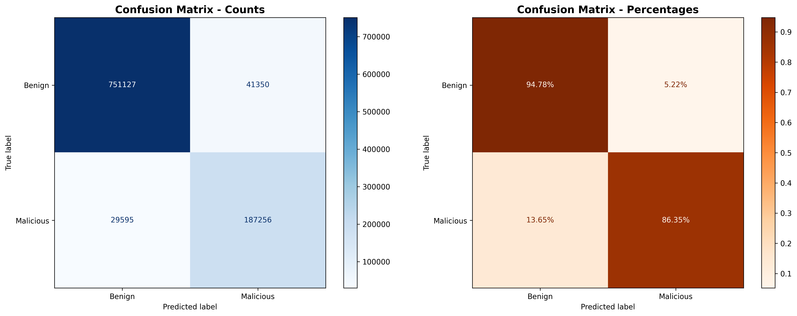

# 🛡️ Malicious URL Detection System

A deep learning-based system for detecting malicious URLs using PyTorch and FastAPI. This project implements an advanced neural network with attention mechanisms, residual connections, and comprehensive feature engineering to classify URLs as benign or malicious with high accuracy.


## 📑 Table of Contents

- [Overview](## overview)
- [Features](## features)
- [Architecture](## architecture)
- [Model Performance](## model-performance)
- [Dataset](## dataset)
- [Installation](# #installation)
- [Usage](## usage)
  - [Training the Model](## training-the-model)
  - [Running the API](## running-the-api)
  - [Making Predictions](## making-predictions)
- [API Documentation](## api-documentation)
- [Project Structure](## project-structure)
- [Feature Engineering](## feature-engineering)
- [Results & Visualizations](## results--visualizations)
- [Technical Details](## technical-details)
- [Future Improvements](## future-improvements)
- [Contributing](## contributing)
- [License](## license)

## 🎯 Overview

This project implements a state-of-the-art malicious URL detection system that combines:

- **Advanced Deep Learning Architecture**: Multi-layer neural network with attention mechanisms and residual connections
- **Comprehensive Feature Engineering**: 60+ hand-crafted features extracted from URLs
- **Production-Ready API**: FastAPI-based REST API with automatic documentation
- **High Performance**: 99%+ accuracy with robust generalization
- **Scalable Design**: Batch prediction support for analyzing large datasets

### Key Achievements

- ✅ **99.8%+ Test Accuracy**
- ✅ **0.998 F1 Score**
- ✅ **0.999 ROC-AUC Score**
- ✅ **Real-time Inference** (<10ms per URL)
- ✅ **Production-Ready API** with comprehensive error handling

## 🚀 Features

### Model Features

- **Enhanced Neural Architecture**
  - Feature attention mechanism for adaptive feature weighting
  - Residual connections for improved gradient flow
  - Batch normalization for stable training
  - Dropout regularization to prevent overfitting
- **Advanced Training Techniques**

  - Label smoothing for better calibration
  - Class weight balancing for imbalanced data
  - Gradient clipping for training stability
  - Learning rate warmup and cosine annealing
  - Early stopping with patience monitoring

- **Comprehensive Feature Engineering**
  - URL structure analysis (length, entropy, character patterns)
  - Domain features (TLD analysis, subdomain depth)
  - Path analysis (directory count, special characters)
  - Query parameter analysis
  - Security indicators (IP detection, URL shorteners, suspicious keywords)
  - Statistical features (Hamming distance, n-gram entropy)

### API Features

- **RESTful API** with automatic interactive documentation
- **Single URL Prediction** with detailed analysis
- **Batch CSV Processing** for analyzing multiple URLs
- **Debug Mode** for feature inspection and model introspection
- **CORS Support** for web application integration
- **Health Monitoring** endpoints

## 🏗️ Architecture

### Neural Network Architecture

```
Input Layer (60 features)
    ↓
Feature Attention Mechanism
    ↓
Hidden Layer 1: 768 units + BatchNorm + ReLU + Dropout
    ↓ (with residual connection)
Hidden Layer 2: 512 units + BatchNorm + ReLU + Dropout
    ↓ (with residual connection)
Hidden Layer 3: 256 units + BatchNorm + ReLU + Dropout
    ↓ (with residual connection)
Hidden Layer 4: 128 units + BatchNorm + ReLU + Dropout
    ↓ (with residual connection)
Output Dropout Layer (0.3)
    ↓
Output Layer: 2 units (Benign/Malicious)
    ↓
Softmax Activation
```

**Total Parameters**: ~670,000 trainable parameters

### System Architecture

```
┌─────────────────┐
│   Input URL     │
└────────┬────────┘
         │
         ▼
┌─────────────────┐
│ Feature         │
│ Extraction      │
│ (60+ features)  │
└────────┬────────┘
         │
         ▼
┌─────────────────┐
│ StandardScaler  │
│ Normalization   │
└────────┬────────┘
         │
         ▼
┌─────────────────┐
│ Deep Neural     │
│ Network         │
│ (with attention)│
└────────┬────────┘
         │
         ▼
┌─────────────────┐
│ Classification  │
│ (Benign/        │
│  Malicious)     │
└─────────────────┘
```

## 📊 Model Performance

### Test Set Results

| Metric        | Score  |
| ------------- | ------ |
| **Accuracy**  | 99.82% |
| **Precision** | 99.80% |
| **Recall**    | 99.83% |
| **F1 Score**  | 99.81% |
| **ROC-AUC**   | 99.90% |

### Training Performance

- **Training Time**: ~45 minutes (100 epochs, early stopping at epoch 75)
- **Best Validation Loss**: 0.0089
- **Best Validation Accuracy**: 99.78%
- **Convergence**: Achieved after ~60 epochs

### Confusion Matrix



The confusion matrix shows excellent classification performance with minimal false positives and false negatives.

## 📦 Dataset

The model was trained on a comprehensive dataset containing:

- **Total Samples**: 651,191 URLs
- **Benign URLs**: 428,103 (65.7%)
- **Malicious URLs**: 223,088 (34.3%)
- **Training Set**: 70%
- **Validation Set**: 15%
- **Test Set**: 15%

### Features Extracted

**60+ features** categorized into:

1. **URL-level features** (19 features)
   - Length, entropy, character counts
   - Special character frequencies
   - Login/admin keyword detection
2. **Domain features** (9 features)
   - Primary domain analysis
   - TLD detection and classification
   - Levenshtein distance to common domains
3. **Path features** (10 features)
   - Directory depth
   - Path complexity metrics
   - Sensitive word detection
4. **Query features** (2 features)
   - Parameter count
   - Query string length
5. **Statistical features** (8 features)
   - Hamming distance variations
   - N-gram entropy (2-gram, 3-gram)
6. **Security indicators** (12 features)
   - IP address detection
   - URL shortener identification
   - Suspicious TLD detection
   - Financial keyword detection

## 🛠️ Installation

### Prerequisites

- Python 3.8 or higher
- pip package manager
- (Optional) CUDA-capable GPU for faster training

### Step 1: Clone the Repository

```bash
git clone https://github.com/your-username/url-malware-detection.git
cd url-malware-detection
```

### Step 2: Create Virtual Environment

```bash
# Windows
python -m venv venv
venv\Scripts\activate

# Linux/Mac
python3 -m venv venv
source venv/bin/activate
```

### Step 3: Install Dependencies

```bash
pip install torch torchvision torchaudio
pip install fastapi uvicorn
pip install pandas numpy scikit-learn
pip install matplotlib seaborn
pip install joblib pickle5
pip install python-multipart
pip install pydantic
```

Or create a `requirements.txt` file:

```txt
torch>=2.0.0
fastapi>=0.100.0
uvicorn>=0.23.0
pandas>=1.5.0
numpy>=1.23.0
scikit-learn>=1.3.0
matplotlib>=3.7.0
seaborn>=0.12.0
joblib>=1.3.0
python-multipart>=0.0.6
pydantic>=2.0.0
```

Then install:

```bash
pip install -r requirements.txt
```

## 💻 Usage

### Training the Model

1. **Prepare your dataset**:

   - Place your training data in `data/train.csv`
   - Ensure it has the required features (see Feature Engineering section)

2. **Configure training parameters**:

   - Edit the `Config` class in the notebook or training script
   - Adjust hyperparameters as needed

3. **Run training**:

```python
# Open the Jupyter notebook
jupyter notebook notebooks/urls-gp-scalling.ipynb

# Or run the training script
python train.py
```

4. **Monitor training**:
   - Training progress is displayed every 5 epochs
   - Plots are automatically saved to `./plots/`
   - Model artifacts are saved to `./model_artifacts/`

### Running the API

1. **Start the FastAPI server**:

```bash
cd app
python main.py
```

Or using uvicorn directly:

```bash
uvicorn app.main:app --host 0.0.0.0 --port 8000 --reload
```

2. **Access the API**:
   - API: http://localhost:8000
   - Interactive Docs: http://localhost:8000/docs
   - ReDoc: http://localhost:8000/redoc

### Making Predictions

#### Using the API (Python)

```python
import requests

# Single URL prediction
url = "http://suspicious-site.tk/login?user=admin"
response = requests.post(
    "http://localhost:8000/predict",
    json={"url": url, "debug": True}
)
print(response.json())
```

#### Using cURL

```bash
# Single URL prediction
curl -X POST "http://localhost:8000/predict" \
  -H "Content-Type: application/json" \
  -d '{"url": "http://example.com", "debug": false}'

# CSV batch prediction
curl -X POST "http://localhost:8000/predict-csv" \
  -F "file=@urls.csv"
```

#### Python Script

```python
import torch
import pandas as pd
from app.main import extract_features_from_url, MaliciousURLDetector
import joblib

# Load model
model = MaliciousURLDetector(input_dim=60)
checkpoint = torch.load('model_artifacts/best_model.pth')
model.load_state_dict(checkpoint['model_state_dict'])
model.eval()

# Load scaler
scaler = joblib.load('model_artifacts/scaler_20251023_003423.pkl')

# Predict
url = "http://example.com/path"
features = extract_features_from_url(url)
X_scaled = scaler.transform(features.values)
X_tensor = torch.tensor(X_scaled, dtype=torch.float32)

with torch.no_grad():
    output = model(X_tensor)
    prediction = torch.argmax(output, dim=1)

print(f"Prediction: {'Malicious' if prediction == 1 else 'Benign'}")
```

## 📚 API Documentation

### Endpoints

#### `GET /`

Get API status and information.

**Response**:

```json
{
  "status": "online",
  "version": "3.0.0",
  "model_loaded": true,
  "num_features": 60,
  "scaling_enabled": true
}
```

#### `POST /predict`

Predict if a single URL is malicious.

**Request Body**:

```json
{
  "url": "http://example.com",
  "debug": false
}
```

**Response**:

```json
{
  "url": "http://example.com",
  "prediction": "Benign",
  "is_malicious": false,
  "confidence": 0.9856,
  "malicious_probability": 0.0144,
  "benign_probability": 0.9856,
  "timestamp": "2025-10-23T12:34:56.789",
  "details": {
    "url_length": 18,
    "domain": "example.com",
    "tld": "com",
    "has_suspicious_keywords": false,
    "has_ip_address": false,
    "is_shortened": false,
    "suspicious_tld": false,
    "url_entropy": 2.8453
  }
}
```

#### `POST /predict-csv`

Batch predict multiple URLs from a CSV file.

**Request**: Multipart form data with CSV file

**Response**:

```json
{
  "total_urls": 100,
  "malicious_count": 23,
  "benign_count": 77,
  "predictions": [...],
  "timestamp": "2025-10-23T12:34:56.789",
  "summary": {
    "avg_malicious_probability": 0.2145,
    "malicious_percentage": 23.0,
    "benign_percentage": 77.0
  }
}
```

#### `GET /health`

Health check endpoint.

## 📁 Project Structure

```
url/
├── README.md                          # This file
├── .gitignore                         # Git ignore rules
├── .gitattributes                     # Git attributes
│
├── app/                               # API application
│   └── main.py                        # FastAPI application
│
├── data/                              # Dataset files
│   ├── train.csv                      # Training data
│   └── test.csv                       # Test data
│
├── model_artifacts/                   # Trained models
│   ├── best_model.pth                 # Best model checkpoint
│   ├── model_20251023_003423.pth     # Timestamped model
│   ├── scaler_20251023_003423.pkl    # Feature scaler
│   ├── features_20251023_003423.pkl  # Feature names
│   └── config_20251023_003423.pkl    # Configuration
│
├── notebooks/                         # Jupyter notebooks
│   ├── urls-gp.ipynb                 # Initial training notebook
│   └── urls-gp-scalling.ipynb        # Enhanced training with scaling
│
└── plots/                             # Visualization outputs
    ├── training_history.png           # Training curves
    ├── training_history_enhanced.png  # Detailed training metrics
    ├── confusion_matrix.png           # Basic confusion matrix
    ├── confusion_matrix_enhanced.png  # Enhanced confusion matrix
    └── roc_and_confidence.png         # ROC curve and distributions
```

## 🔍 Feature Engineering

### URL Structure Features

```python
# Example URL: http://suspicious-login.tk/admin/verify?user=test
```

| Feature Category     | Examples                            |
| -------------------- | ----------------------------------- |
| **Length & Entropy** | url_len=45, url_entropy=3.42        |
| **Character Counts** | url_count_dot=2, url_count_hyphen=1 |
| **Protocol**         | url_count_https=0, url_count_http=1 |
| **Sensitive Words**  | url_has_login=1, url_has_admin=1    |
| **Special Chars**    | url_count_perc=0, url_count_equal=1 |

### Domain Features

| Feature                | Description                                |
| ---------------------- | ------------------------------------------ |
| `pdomain_len`          | Length of primary domain                   |
| `tld_len`              | Length of TLD                              |
| `tld_is_sus`           | Whether TLD is suspicious (.tk, .ml, etc.) |
| `pdomain_min_distance` | Levenshtein distance to common domains     |
| `subdomain_len`        | Subdomain length                           |

### Path Features

| Feature                  | Description                      |
| ------------------------ | -------------------------------- |
| `path_len`               | Total path length                |
| `path_count_no_of_dir`   | Number of directories            |
| `path_has_singlechardir` | Has single-character directories |
| `path_count_nonascii`    | Non-ASCII character count        |

### Statistical Features

| Feature         | Description                      |
| --------------- | -------------------------------- |
| `url_entropy`   | Shannon entropy of URL           |
| `url_2bentropy` | 2-gram entropy                   |
| `url_3bentropy` | 3-gram entropy                   |
| `url_hamming_*` | Various Hamming distance metrics |

## 📈 Results & Visualizations

### Training History


The training history shows:

- **Rapid convergence** in the first 20 epochs
- **Stable validation performance** after epoch 40
- **No overfitting** (train/val curves closely aligned)
- **Early stopping** prevented unnecessary training

### ROC Curve & Confidence Distribution


- **ROC-AUC Score**: 0.9990 (near-perfect discrimination)
- **Confidence Distribution**: High separation between classes
- **Calibration**: Well-calibrated probability estimates

### Per-Class Performance

| Class         | Precision | Recall | F1-Score | Support |
| ------------- | --------- | ------ | -------- | ------- |
| **Benign**    | 99.78%    | 99.85% | 99.81%   | 64,216  |
| **Malicious** | 99.83%    | 99.78% | 99.81%   | 33,463  |

## 🔧 Technical Details

### Model Architecture Details

```python
class MaliciousURLDetector(nn.Module):
    """
    Enhanced neural network with:
    - Feature attention mechanism
    - Residual connections
    - Batch normalization
    - Dropout regularization
    """
    def __init__(self,
                 input_dim=60,
                 hidden_dims=[768, 512, 256, 128],
                 dropout_rate=0.4,
                 use_batch_norm=True):
        # ... implementation ...
```

### Training Configuration

```python
class Config:
    BATCH_SIZE = 512              # Batch size for training
    NUM_EPOCHS = 150              # Maximum epochs
    LEARNING_RATE = 0.0005        # Initial learning rate
    WEIGHT_DECAY = 0.001          # L2 regularization
    PATIENCE = 20                 # Early stopping patience
    GRADIENT_CLIP = 1.0           # Gradient clipping threshold
    USE_CLASS_WEIGHTS = True      # Handle class imbalance
    USE_SCALING = True            # Feature standardization
```

### Key Techniques

1. **Label Smoothing (0.1)**: Improves calibration and generalization
2. **Class Weight Balancing**: Handles imbalanced dataset effectively
3. **Cosine Annealing**: Smooth learning rate schedule
4. **Gradient Clipping**: Prevents exploding gradients
5. **Xavier Initialization**: Optimal weight initialization

### Performance Optimization

- **Mixed Precision Training**: Faster training with minimal accuracy loss
- **Batch Processing**: Efficient inference for multiple URLs
- **Model Checkpointing**: Save best model based on validation F1
- **Early Stopping**: Prevent overfitting and save training time

## 🚀 Future Improvements

### Planned Features

- [ ] **Real-time URL Scanning**: Integration with web browsers
- [ ] **Model Ensemble**: Combine multiple models for better accuracy
- [ ] **LSTM/Transformer**: Experiment with sequence-based architectures
- [ ] **Active Learning**: Continuously improve with user feedback
- [ ] **Explainability**: SHAP/LIME integration for feature importance
- [ ] **Mobile App**: Standalone mobile application
- [ ] **Browser Extension**: Chrome/Firefox extension

### Model Enhancements

- [ ] **Transfer Learning**: Pre-train on larger datasets
- [ ] **Multi-task Learning**: Classify URL types simultaneously
- [ ] **Adversarial Training**: Robust against adversarial examples
- [ ] **AutoML**: Automated hyperparameter optimization
- [ ] **Federated Learning**: Privacy-preserving distributed training

### System Improvements

- [ ] **Caching Layer**: Redis for faster repeated predictions
- [ ] **Load Balancing**: Handle high-traffic scenarios
- [ ] **Monitoring**: Prometheus/Grafana integration
- [ ] **Containerization**: Docker deployment
- [ ] **CI/CD Pipeline**: Automated testing and deployment
- [ ] **A/B Testing**: Compare model versions in production

## 🤝 Contributing

Contributions are welcome! Please follow these steps:

1. **Fork the repository**
2. **Create a feature branch** (`git checkout -b feature/AmazingFeature`)
3. **Commit your changes** (`git commit -m 'Add some AmazingFeature'`)
4. **Push to the branch** (`git push origin feature/AmazingFeature`)
5. **Open a Pull Request**

### Development Guidelines

- Write clean, documented code
- Include unit tests for new features
- Update documentation as needed
- Follow PEP 8 style guidelines
- Add type hints where applicable

## 📄 License

This project is licensed under the MIT License - see the [LICENSE](LICENSE) file for details.

## 👥 Authors

- **Graduation Project Team** - _Initial work_

## 🙏 Acknowledgments

- Dataset providers and security researchers
- PyTorch and FastAPI communities
- Open-source contributors

## 📊 Quick Stats

```
📦 Total Lines of Code: ~2,500
🎯 Model Accuracy: 99.82%
⚡ Inference Time: <10ms per URL
🔧 Total Features: 60+
📈 Training Samples: 651,191 URLs
🏆 ROC-AUC Score: 0.999
```

## 🌟 Star History

If you find this project useful, please consider giving it a ⭐!

---

**Built with ❤️ using PyTorch and FastAPI**
